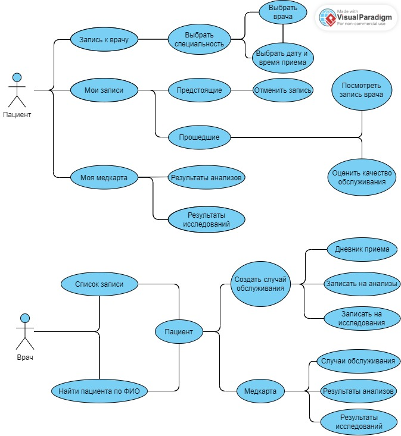

# Архитектура ПО. Семинары
## Заголовок
1. [Семинар 2. Объектно-ориентированные паттерны](#семинар-2-объектно-ориентированные-паттерны)
2. [Семинар 3. Принципы SOLID](#семинар-3-принципы-solid)
3. [Семинар 4. Компоненты. Принципы связности и сочетаемости компонентов](#семинар-4-компоненты-принципы-связности-и-сочетаемости-компонентов)
4. [Семинар 6. Принципы построения приложений «чистая архитектура»](#семинар-6-принципы-построения-приложений-«чистая-архитектура»)
5. [Семинар 7. Типа архитектур WEB-приложений: MPA, SPA.](#семинар-7-типа-архитектур-web-приложений-mpa-spa)
6. [Семинар 8. Типы архитектур прикладных приложений (мобильные): MVC, MVP, MVVM.](#семинар-8-типы-архитектур-прикладных-приложений-мобильные-mvc-mvp-mvvm)
7. [Семинар 9. Способы организации передачи данных между компонентами приложения, протоколы и API. REST, gRPC, очереди](#Семинар-9-способы-организации-передачи-данных-между-компонентами-приложения-протоколы-и-api-rest-grpc-очереди)
8. [Семинар 10. Структура приложения с пользовательским интерфейсом и базой данных (паттерн Repository)](#семинар-10-структура-приложения-с-пользовательским-интерфейсом-и-базой-данных-паттерн-repository)
## Семинар 2. Объектно-ориентированные паттерны

__Домашнее задание__:
Закончить разработку паттерна Фабричный метод

## Семинар 3. Принципы SOLID
__Домашнее задание__:
Реализовать принципы: DIP, ISP, LSP, OCP, SRP.

## Семинар 4. Компоненты. Принципы связности и сочетаемости компонентов

.jpg)

## Семинар 6. Принципы построения приложений «чистая архитектура»
__Домашнее задание__:
Разработать полную ERD домена в https://www.dbdesigner.net/.

__Выполнение__:

## Семинар 7. Типа архитектур WEB-приложений: MPA, SPA.
__Домашнее задание__:
Доработать экранные формы интерфейса в https://www.figma.com/ или https://app.diagrams.net/.
Разработать полную ERD домена в https://www.dbdesigner.net/.
Разработать диаграмму компонент в UML включая слои пользовательского интерфейса и бизнес-логики.

__Выполнение:__

## Семинар 8. Типы архитектур прикладных приложений (мобильные): MVC, MVP, MVVM.

__Домашнее задание__:
Разработать экранные формы интерфейса в https://www.figma.com/ или https://app.diagrams.net/.
Разработать полную ERD домена в https://www.dbdesigner.net/.
Разработать блок-схему алгоритма взамодействия MVP.

__Выполнение__:

## Семинар 9. Способы организации передачи данных между компонентами приложения, протоколы и API. REST, gRPC, очереди
__Домашнее задание__:
Разработать полную ERD домена в https://www.dbdesigner.net/.
Дополнить swagger ответами домена (сутевые ответы) о статусе заказа ресурсов (создан, ошибка, нет ответа) и смоделировать ошибки REST «400, 500» типов.
Имплементировать сгенерированный swagger код в приложения студента.

__Выполнение__:

_Код в дерктории "sem9"_

## Семинар 10. Структура приложения с пользовательским интерфейсом и базой данных (паттерн Repository)
__Домашнее задание__:
1. Разработать полную ERD домена сервера в https://www.dbdesigner.net/.

2. Сделать графический интерфейс для мобильного приложения

3. Разработать USERCASE диаграмму управления роботом пылесосом

__Выполнение__:
1. UserCase:

2. Interface:
