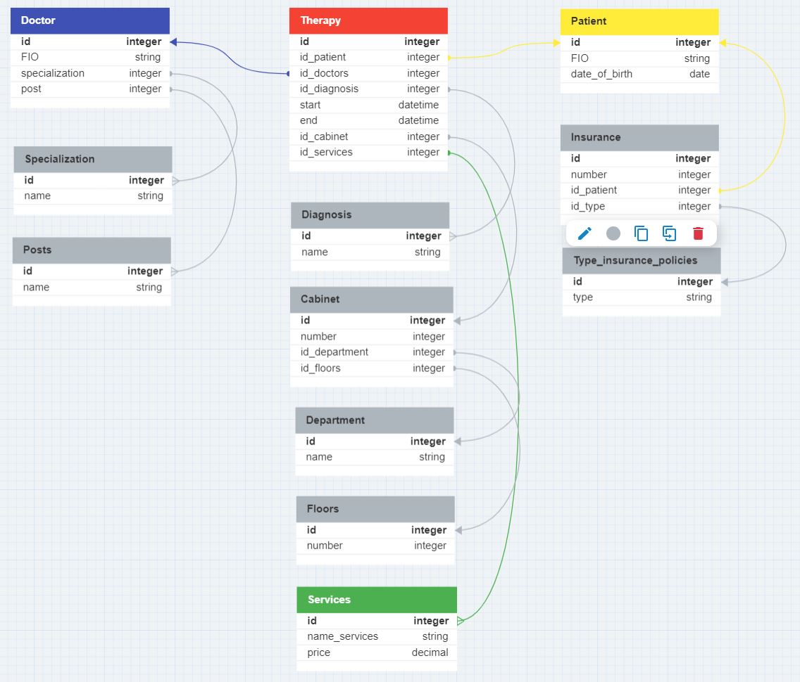

# Архитектура ПО. Семинары
## Заголовок
1. [Семинар 2. Объектно-ориентированные паттерны](#семинар-2-объектно-ориентированные-паттерны)
2. [Семинар 3. Принципы SOLID](#семинар-3-принципы-solid)
3. [Семинар 4. Компоненты. Принципы связности и сочетаемости компонентов](#семинар-4-компоненты-принципы-связности-и-сочетаемости-компонентов)
4. [Семинар 6. Принципы построения приложений «чистая архитектура»](#семинар-6-принципы-построения-приложений-«чистая-архитектура»)
5. [Семинар 7. Типа архитектур WEB-приложений: MPA, SPA.](#семинар-7-типа-архитектур-web-приложений-mpa-spa)

## Семинар 2. Объектно-ориентированные паттерны

__Домашнее задание__:
Закончить разработку паттерна Фабричный метод

## Семинар 3. Принципы SOLID
__Домашнее задание__:
Реализовать принципы: DIP, ISP, LSP, OCP, SRP.

## Семинар 4. Компоненты. Принципы связности и сочетаемости компонентов

.jpg)

## Семинар 6. Принципы построения приложений «чистая архитектура»
__Домашнее задание__:
Разработать полную ERD домена в https://www.dbdesigner.net/.

__Выполнение__:

## Семинар 7. Типа архитектур WEB-приложений: MPA, SPA.
__Домашнее задание__:
Доработать экранные формы интерфейса в https://www.figma.com/ или https://app.diagrams.net/.
Разработать полную ERD домена в https://www.dbdesigner.net/.
Разработать диаграмму компонент в UML включая слои пользовательского интерфейса и бизнес-логики.

__Выполнение:__

## Семинар 8. Типы архитектур прикладных приложений (мобильные): MVC, MVP, MVVM.

__Домашнее задание__:
Разработать экранные формы интерфейса в https://www.figma.com/ или https://app.diagrams.net/.
Разработать полную ERD домена в https://www.dbdesigner.net/.
Разработать блок-схему алгоритма взамодействия MVP.

__Выполнение__:

